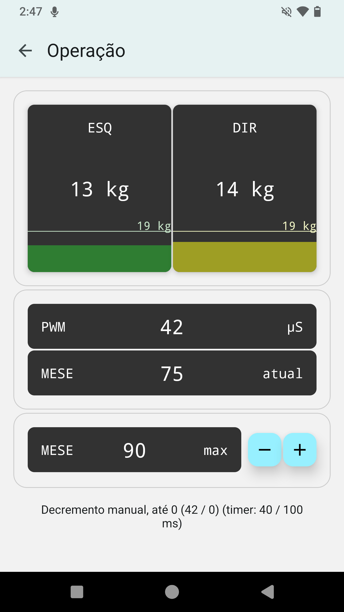

# Interface EE LENeR

## Aplicativo

### Compilação

É preciso ter o Android Studio instalado, com a SDK Android 33 configurada.

```sh
cd mobile_interface
npx eas-cli build --platform=android --profile=production --local
```

### Desenvolvimento

É possível editar o aplicativo sem recompilá-lo toda vez, usando a função de dev client do Expo. Como o aplicativo utiliza bibliotecas nativas (principalmente, a react-native-ble-plx para comunicação Bluetooth), é preciso criar um dev client customizado (não o Expo Go). Compile o dev client dessa forma:

```sh
cd mobile_interface
npx eas-cli build --platform=android --profile=development --local
```

Após isso, execute o servidor do Expo:

```
npx expo start --tunnel
```

Instale o apk do dev client, e digite a URL mostrada no terminal.

## Firmware do Gateway e Estimulador

É preciso ter o PlatformIO instalado em alguma IDE, idealmente o VS Code.

### Dados da balança simulados

Durante o desenvolvimento, foi usado um potênciometro para simular as leituras das balanças. No laboratório, é preciso desativar o código de simulação de balanças para obter as leituras reais.

No arquivo `gateway/src/Scale/Scale.h`, comente/remova a linha `#define SCALE_USE_STUB`, para que o código das balanças reais seja incluso no firmware.

### Hardware Gateway no laboratório

Durante o desenvolvimento, foi utilizado outro ESP-32 para o gateway. No laboratório, ao usar o gateway real, é preciso definir os pinouts corretos. No arquivo `gateway/Twai/Twai.h`, comente os `#define`s respectivos ao desenvolvimento, deixando apenas os `#define`s referentes ao laboratório.

## Screenshots do aplicativo



